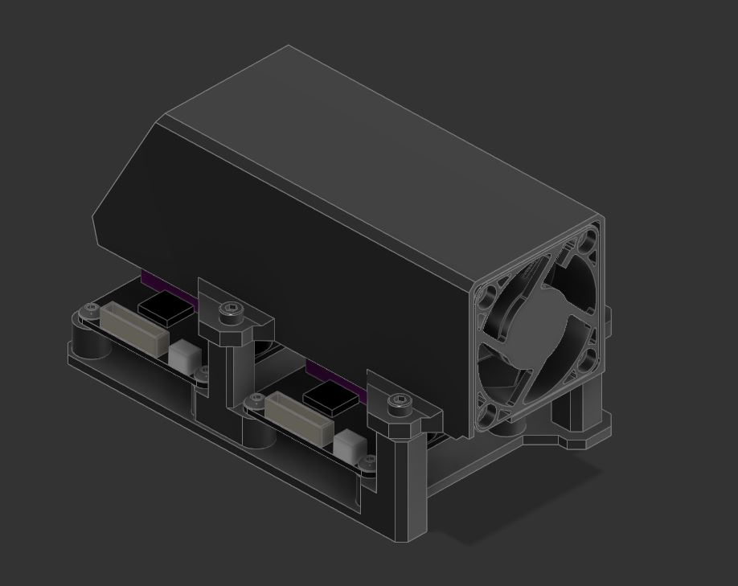
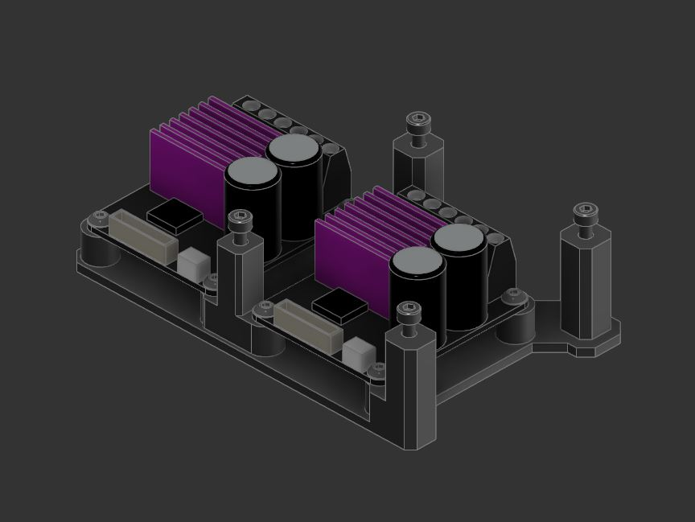

# Double Mellow TMC5160 Mount

Mount for Mellow Fly TMC5160 Pro modules with air ducts for cooling.

## Introduction

I didn't like the idea of using dedicated fans for cooling TMC5160 modules as part of my conversion to 48v; which is the most common configuration I have seen online so far. These modules do not need a ton of air for cooling since on regular printers we can't/don't want to be running crazy amps out of it anyway, so I figured a regular 4020 fan should do the trick to cool two modules at once. 
These are desgined with the Mellow Fly TMC5160 Pro v1.2 modules in mind. I do not think the v1.5 version will have any issue to fit but that is something I have not tested.

## BOM

These quantities are for 2 TMC5160

- 8x M3x6mm BHCB
- 4x M3x30mm SHCB
- 4x M3x5x4mm “standard” Voron heatsets"
- 1x 4020 Fan
- VHB Tape (for mounting directly onto the bottom panel)

